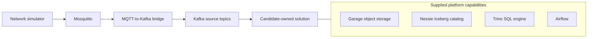

# Senior Data Engineering Builder's Challenge

## Job To Be Done

You have joined a team that has been asked to establish baseline performance
and reliability metrics for a subset of internet infrastructure across the
state of Arkansas. Network devices have recently begun publishing telemetry,
but the organization does not yet have a trustworthy way to capture, retain,
query, or interpret it.

Your task is to build the first version of that data foundation. Engineering
and operations teams need to understand normal performance across devices,
technologies, providers, and locations; recognize data-quality problems; find
infrastructure that performs unusually compared with appropriate peers; and
investigate whether shared network dependencies affect multiple sites.

The supplied environment simulates hundreds of network devices,
forwards their telemetry through MQTT into Kafka, and provides a local Iceberg
lakehouse backed by S3-compatible object storage and queryable through Trino.
Your solution should consume the Kafka streams, validate and persist the data,
load the supplied network and Census reference files, answer operational and
analytical questions with SQL, and use Airflow for workflow orchestration.

The supplied inventory and telemetry are synthetic and cover only this
Arkansas pilot population. They do not represent a complete view of the
state's residents, providers, or internet service, and the results should not
be interpreted as claims about real Arkansas networks. The design should still
be structured so that you can explain how it would evolve to support broader
geography, higher event volume, and production operations.

We are interested in correctness, engineering judgment, reliability,
maintainability, and your ability to explain tradeoffs. A smaller complete
design with clearly stated limitations is more valuable than a large unfinished
design.

At Ready we support and encourage the use of AI coding assistance and welcome
you to do the same. Replace the placeholder in `solution/AI_USAGE.md` with a
disclosure of the capacity in which you leveraged AI assistants. You'll be
expected to have a full understanding of all code submitted without the
assistance of AI.

At a glance, your submission must include:

- [ ] A reproducible solution under `solution/` that integrates with the
      supplied Docker Compose startup without undocumented host dependencies.
- [ ] Continuous ingestion for all five supplied Kafka event topics.
- [ ] Contract validation, durable reject isolation, source lineage, and
      reliable interruption/restart behavior.
- [ ] The required `iceberg.solution` tables available through Trino:
  - [ ] Four reference tables: `sites`, `devices`, `device_dependencies`, and
        `census_block_groups`.
  - [ ] Five event tables: `connectivity_events`, `throughput_events`,
        `device_health_events`, `connectivity_state_events`, and
        `infrastructure_events`.
  - [ ] Invalid-input table: `rejected_events`.
- [ ] At least five documented read-only SQL reports addressing five different
      listed analytical perspectives, with an inventory under `solution/sql/`.
- [ ] The required manual Airflow workflows:
  - [ ] `manual_sql_to_csv`.
  - [ ] `lakehouse_quality`.
  - [ ] `iceberg_maintenance`.
- [ ] At least one successfully generated, host-visible CSV demonstrated from
      a submitted SQL report; generated CSVs are not submission artifacts.
- [ ] Focused tests for important transformation and failure behavior.
- [ ] A complete `solution/README.md` with architecture, operating commands,
      design decisions, failure semantics, assumptions, and limitations.
- [ ] A completed `solution/AI_USAGE.md` disclosing the capacity in which AI
      assistants were used.
- [ ] A clean Git repository or ZIP submission without secrets, caches,
      virtual environments, generated data, or Docker-volume contents.

## Architecture

The simulator, MQTT-to-Kafka path, and base platform services are supplied.
Your work begins at Kafka and lives under `solution/`. The supplied services
define available capabilities and integration boundaries; they do not
prescribe the internal architecture, component topology, or deployment model
of your solution.



Garage supplies the local S3-compatible object store, Nessie supplies the
Iceberg REST catalog, and Trino exposes the resulting tables through SQL.
PostgreSQL is internal metadata storage for Nessie and Airflow; it is not a
pipeline source or analytical destination.

## What You'll Do

All candidate-owned implementation and documentation must live under the
top-level `solution/` directory. Reviewers will evaluate that directory. Changes
elsewhere in the supplied package are not required for your solution to
work and will not be treated as candidate implementation evidence.

You may organize `solution/` as you see fit, but preserve these integration
paths:

```text
solution/
├── README.md
├── AI_USAGE.md
├── docker-compose.yml
├── ingestion/
├── airflow/
│   └── dags/
├── sql/
└── exports/
```

The final runtime must be reproducible with Docker Compose and must not depend
on undocumented packages installed on the reviewer's host. A project-local
virtual environment is welcome for IDE development and fast tests, but it is
not the evaluation runtime.

## Required implementation

### 1. Streaming ingestion and validation

Continuously ingest all five supplied Kafka topics. Your solution must:

- validate records against the supplied contracts;
- store accepted records in the required Iceberg tables;
- isolate rejected records without blocking valid data;
- preserve typed values, measurement time, and useful source lineage;
- resume safely after a normal interruption without resetting persistent
  volumes; and
- expose enough progress and error information to diagnose the pipeline.

The source conditions described under
[Telemetry and Kafka behavior](TECHNICAL_GUIDE.md#telemetry-and-kafka-behavior)
are normal input conditions. Document your ingestion deployment, Airflow's
role, and the solution's delivery and recovery behavior.

### 2. Iceberg and reference-data interface

Create the `iceberg.solution` namespace and make these tables queryable through
Trino:

| Kind | Required table |
| --- | --- |
| Reference | `sites` |
| Reference | `devices` |
| Reference | `device_dependencies` |
| Reference | `census_block_groups` |
| Event | `connectivity_events` |
| Event | `throughput_events` |
| Event | `device_health_events` |
| Event | `connectivity_state_events` |
| Event | `infrastructure_events` |
| Invalid input | `rejected_events` |

Event tables must expose the contract fields, typed payload fields, and useful
source lineage. The reject table must preserve the original value or a lossless
encoding, Kafka coordinates, and a concise reason.

Load the four required reference files idempotently and validate their counts,
identifiers, and relationships. GeoJSON and Census Place enrichment is optional.

Document your Iceberg partitioning, file format, compression, and table
properties. Additional curated or aggregate tables are optional.

### 3. Analytical SQL

Submit at least five read-only `.sql` reports under `solution/sql/`, each
addressing a different perspective below. Each file must contain one query,
use stable unique column names, document its grain and assumptions, and use
deterministic ordering when results will be compared or exported.

1. Accepted event totals by event family and useful inventory dimensions.
2. Reconciliation of duplicates, sequence gaps, rejects, late data, and
   duplicate-safe counts.
3. Device connectivity and throughput statistics, including minimum, maximum,
   median, and a defensible high percentile where relevant.
4. Equivalent statistics by access technology.
5. Devices underperforming an appropriate peer group.
6. Provider, technology, or another defensible service-cohort comparison.
7. Geographic performance patterns using location and Census context.
8. Connectivity-state duration or availability derived from event time.
9. Shared incidents and downstream impact, including critical infrastructure.
10. Late records attributed by measurement time rather than arrival time.

Map each report to its selected perspective in `solution/sql/README.md`.
Explain important thresholds or peer definitions, and do not hard-code an
identifier or expected result from one run.

### 4. Airflow workflows

Supply these finite, manually triggered DAGs under `solution/airflow/dags/`:

| DAG ID | Required behavior |
| --- | --- |
| `manual_sql_to_csv` | Execute one selected checked-in SQL report through Trino and publish its result as CSV |
| `lakehouse_quality` | Validate reference completeness/relationships and reconcile captured event quality |
| `iceberg_maintenance` | Inspect small-file behavior and perform only justified, safely bounded maintenance |

The workflows must satisfy these outcomes:

- `manual_sql_to_csv` accepts one checked-in, read-only report and writes a
  complete UTF-8 CSV beneath `solution/exports/` with stable headers, standard
  quoting, and documented null handling. Handle collisions, reruns, and
  failures safely; expose enough metadata to locate and verify the output; and
  do not assume an unbounded result fits in task memory or Airflow metadata.
- `lakehouse_quality` checks reference and event consistency, exposes its
  findings, and distinguishes failures from investigation warnings.
- `iceberg_maintenance` provides a non-mutating plan and performs only safe,
  justified, bounded work. Document selection, rerun, and failure behavior.

The DAGs must remain independently operable. Destructive catalog or object
cleanup is out of scope.

Generated CSV files are runtime artifacts and should not be committed or
included in the submission.

### 5. Tests and documentation

Include focused, documented tests for important logic and failure boundaries.
No particular framework or coverage percentage is required.

Your `solution/README.md` must make the submission independently operable and
explain:

- architecture, component responsibilities, failure boundaries, and Airflow's
  role;
- major design choices, alternatives, assumptions, and limitations;
- exact build, start, observe, query, test, stop, and reset commands;
- tables, SQL reports, DAG parameters, outputs, reruns, and safety behavior;
- source delivery, rejection, interruption, replay, and recovery behavior; and
- dependencies and changes you would make for production or higher volume.

During review, you should be prepared to trace an event through your design,
explain interruption and recovery behavior, and discuss or make a small change
to the submitted solution.

## Running and demonstrating the solution

Start the supplied infrastructure and candidate overlay from the repository
root:

```bash
docker compose \
  -f docker-compose.yml \
  -f solution/docker-compose.yml \
  up -d --build
```

Document any additional initialization that cannot safely occur as part of that
command. Reviewers should not need to edit files or install host dependencies to
make the normal data path work.

Allow the simulator and ingestion to run for at least ten minutes before
evaluating analytical results. Because intentionally delayed data may arrive
after its measurement interval, document any additional drain time or bounded
window convention used by your reports.

At minimum, your demonstration should show:

- all required reference and event tables queryable through Trino;
- imperfect source data handled without preventing continued valid processing,
  with enough evidence to investigate the resulting data quality;
- useful analytical results for the perspectives selected in your submitted
  SQL reports;
- the quality DAG completing against a healthy populated solution;
- the maintenance DAG producing a safe plan without unnecessary rewrites; and
- the export DAG producing a readable host-visible CSV from one submitted SQL
  file.

The local endpoints and development credentials are documented in the
[technical guide](TECHNICAL_GUIDE.md). The Airflow UI is available at
`http://localhost:8081`
with the supplied local credentials `airflow` / `airflow`.

## Constraints and non-goals

- Do not modify, replace, or reverse-engineer the supplied simulator to produce
  expected answers. Your solution should generalize to other seeds and device
  sessions.
- Do not require AWS, another cloud account, or external managed services.
- Make Airflow's responsibilities explicit and justify them in your solution
  documentation.
- Do not rely on generated CSV exports, Docker volumes, credentials, caches,
  local virtual environments, or other runtime artifacts being included in the
  submitted source.
- Prefer a clear, reproducible implementation over sophisticated Docker or
  infrastructure mechanics that do not improve the data pipeline.

## Submission

Submit your completed challenge as either a Git repository or ZIP file while
preserving the supplied repository layout. Reviewers will examine the contents
of `solution/`; generated data, Docker volumes, CSV exports, and changes outside
that directory are not required submission evidence.

Before submitting, verify from a clean checkout or extracted ZIP that your
documented build and startup path works without untracked local dependencies.
Do not include secrets, `.env` files containing private values, virtual
environments, caches, or large generated data files.

## Evaluation approach

Review combines execution of the submitted solution with engineering review
and discussion. We will consider:

- end-to-end correctness and faithful source capture;
- Kafka progress, replay, restart, and failure semantics;
- Iceberg modeling and file-management choices;
- validation and reject handling;
- SQL correctness, analytical reasoning, and event-time treatment;
- Airflow task boundaries, safety, and operability;
- bounded resource use and reproducibility;
- code clarity, testing, and documentation; and
- your ability to explain tradeoffs and describe a production evolution.

Alternative designs are welcome when they satisfy the observable requirements
and their tradeoffs are explained. The challenge is intended to evaluate data
engineering judgment, not conformity to one prescribed implementation.
