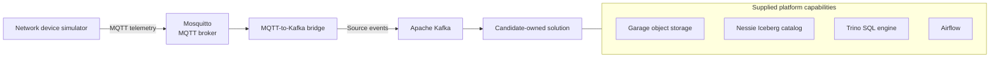

# Builder's Challenge Technical Guide

## Start here

This challenge gives you a simulated internet network running on your computer.
Hundreds of devices send telemetry through MQTT and Kafka. You will build the
solution that validates, stores, and analyzes those messages under `solution/`.

Read the [challenge prompt](README.md) for the assignment,
deliverables, and evaluation approach. This README explains the supplied local
environment and source interfaces. Component READMEs provide deeper reference
material when needed.

## Quick start

We recommend macOS or Linux. Windows users should use a Linux environment such
as WSL 2. Before starting, install:

- Docker Desktop on macOS, or Docker Engine on Linux;
- Docker Compose v2 through the `docker compose` command; and
- Bash for the supplied smoke test.

The environment runs Kafka, Trino, Airflow, PostgreSQL, Garage, and supporting
services together. We recommend allocating at least 8 GB of memory to Docker.

Start and validate the supplied infrastructure from the repository root:

```bash
docker compose up -d
docker compose ps
./tests/smoke/infra.sh
```

The `kafka-init` and `airflow-init` containers are one-shot initializers and
should exit with status code `0`. The remaining services should become healthy.

Local endpoints are bound only to `127.0.0.1`:

| Service | Endpoint |
| --- | --- |
| MQTT | `localhost:1883` |
| Kafka | `localhost:9092` |
| Garage S3 API | `http://localhost:3900` |
| Nessie and Iceberg REST | `http://localhost:19120` |
| Trino | `http://localhost:8080` |
| Airflow | `http://localhost:8081` |

The checked-in development credentials are sufficient. No cloud account or
manual secret generation is required.

## Architecture

The supplied environment represents a small local streaming lakehouse. The
candidate-owned solution begins at Kafka; its internal topology and deployment
model are design choices for the candidate.



Garage stores Iceberg data and metadata files, Nessie manages the Iceberg
catalog, and Trino queries the resulting tables. PostgreSQL stores internal
Nessie and Airflow state; it is not a pipeline source or analytical destination.

## What's included

The challenge package provides:

- base Docker Compose services for Kafka, Mosquitto, Garage, Nessie, Trino,
  PostgreSQL, and Airflow;
- a deterministic device simulator and MQTT-to-Kafka bridge;
- five populated Kafka source topics;
- JSON Schemas and examples under `contracts/events/`;
- versioned network inventory and Census inputs under `reference-data/`; and
- starter paths under `solution/` for candidate-owned code.

Candidates define the services and dependencies required by their design.
Airflow discovers DAGs beneath `solution/airflow/dags`, mounts `solution/sql`
and `reference-data` read-only, and exposes `solution/exports` for generated CSV
artifacts.

### Kafka source topics

| Kafka topic | Event type | What it captures |
| --- | --- | --- |
| `network.connectivity` | `connectivity_metric` | Latency, jitter, and packet loss |
| `network.throughput` | `throughput_test` | Download and upload speed tests |
| `network.device_health` | `device_health` | Resource health and technology-specific signal measurements |
| `network.state` | `connectivity_state` | Access-device state transitions and reasons |
| `network.infrastructure` | `infrastructure_event` | Shared-infrastructure incident lifecycle and severity |

### Reference data

The required reference inputs describe a fictional Arkansas network and use
aggregate 2020 U.S. Census Bureau context. They contain no real subscriber
addresses or observed connectivity data.

| File | Purpose |
| --- | --- |
| `reference-data/inventory/v1/sites.csv` | Site, location, geography, and critical-infrastructure attributes |
| `reference-data/inventory/v1/devices.csv` | Device, site, provider, technology, model, role, and service attributes |
| `reference-data/inventory/v1/device_dependencies.csv` | Access-to-aggregation-to-backhaul-to-IXP relationships |
| `reference-data/census/v1/census_block_groups.csv` | Block-group population, land area, density, and representative coordinates |

The inventory joins through `site_id` and `device_id`; sites join to Census data
through `block_group_geoid`. Checked-in manifests and component READMEs contain
exact schemas, row counts, checksums, and provenance. Additional GeoJSON and
Census Place files are available for optional geographic enrichment; no Census
download or GIS tooling is required.

## Telemetry and Kafka behavior

The simulator publishes three periodic event families and two event-driven
families:

| Event type | Publishing population | Cadence | Approximate rate |
| --- | --- | ---: | ---: |
| `connectivity_metric` | 600 access devices | 5 seconds | 120/sec |
| `throughput_test` | 600 access devices | 60 seconds | 10/sec |
| `device_health` | all 654 devices | 30 seconds | 22/sec |
| `connectivity_state` | affected access devices | event driven | sparse |
| `infrastructure_event` | incident source infrastructure | event driven | sparse |

The combined periodic rate is approximately 152 events/second.

### Event contract

Every event uses this common envelope:

```json
{
  "schema_version": 1,
  "event_id": "d3d89459-cc1b-5bb0-91ef-42e0e6c748ad",
  "event_type": "connectivity_metric",
  "event_timestamp": "2026-08-19T14:32:10.125Z",
  "device_session_id": "56e9c2e2-fb32-5a89-b7fd-55a3ca31ab27",
  "sequence_number": 42,
  "site_id": "site-0001",
  "device_id": "device-0001",
  "payload": {}
}
```

Payload fields vary by event type:

| Event type | Payload fields |
| --- | --- |
| `connectivity_metric` | `latency_ms`, `jitter_ms`, `packet_loss_pct` |
| `throughput_test` | `download_mbps`, `upload_mbps` |
| `device_health` | `cpu_pct`, `memory_pct`, `temperature_c`, plus an applicable access-technology field |
| `connectivity_state` | `previous_state`, `new_state`, `reason` |
| `infrastructure_event` | `incident_id`, `event_kind`, `severity` |

Access-device health contains one technology-specific field:

| Inventory technology | Health field |
| --- | --- |
| `fiber` | `optical_rx_power_dbm` |
| `coax` | `snr_db` |
| `fixed_wireless` | `signal_strength_dbm` |
| `satellite` | `signal_quality_pct` |

Shared-infrastructure health contains only the three common health fields.
Provider, technology, model, role, advertised service, and geography remain in
the inventory and can be joined through `device_id` and `site_id`.

The files under `contracts/events/` are the source of truth for valid records
and include complete examples. Important envelope semantics are:

- `event_timestamp` is the UTC measurement time; the Kafka record timestamp is
  bridge-arrival time.
- Sequences increase within each
  `(device_id, device_session_id, event_type)` stream. A simulator restart
  creates new device sessions.
- `packet_loss_pct` and `signal_quality_pct` are percentages from 0 through 100,
  not fractions.

### Kafka delivery behavior

- Compose services connect to Kafka at `kafka:29092`.
- Every source topic has three partitions.
- Each record uses UTF-8 `device_id` as its key, the original MQTT JSON bytes as
  its value, and no required headers.
- Records for one device preserve bridge-observed order within their keyed
  partition. Do not depend on a specific partition number.
- State records are keyed by the affected access device. Infrastructure records
  are keyed by the source infrastructure device; use the dependency inventory
  to identify downstream devices.
- Delivery is at least once. Records may be duplicated, late, out of order,
  missing from an otherwise increasing sequence, or invalid.
- Source topics retain approximately two hours of history with 15-minute
  segment rolling.

## Operate the environment

### Pause or resume telemetry

To reduce local resource use without clearing volumes or stopping the platform:

```bash
docker compose stop simulator
docker compose start simulator
```

Restarting the simulator creates new device-session identifiers. Candidate
services can continue processing records already in Kafka while it is stopped.

### View logs

```bash
docker compose logs -f SERVICE
```

Replace `SERVICE` with a Compose service such as `kafka`, `trino`, or
`airflow-scheduler`.

### Stop or reset

Stop containers while preserving Kafka data, Garage objects, and metadata:

```bash
docker compose down
```

Start them again with `docker compose up -d`. To permanently delete all named
volume data and return to a clean environment:

```bash
docker compose down --volumes --remove-orphans
```

Reset Garage and catalog state together so table metadata cannot drift from
stored objects.

## Optional production context

<details>
<summary>Local technologies and conceptual AWS equivalents</summary>

These mappings provide context, not migration requirements.

| Local technology | Role | Conceptual AWS equivalent |
| --- | --- | --- |
| Eclipse Mosquitto | MQTT broker | AWS IoT Core |
| Apache Kafka | Source event stream | Amazon MSK |
| Garage | S3-compatible object storage | Amazon S3 |
| Apache Iceberg | Open table format | Iceberg tables on Amazon S3 |
| Nessie Iceberg REST catalog | Catalog and metadata coordination | AWS Glue Data Catalog, conceptually |
| Trino | Distributed SQL query engine | Amazon Athena or Trino on Amazon EMR |
| Apache Airflow | Workflow orchestration | Airflow on Amazon ECS or Amazon EKS |
| PostgreSQL | Nessie and Airflow metadata | Amazon RDS for PostgreSQL or Aurora PostgreSQL-Compatible |
| Docker Compose | Local service orchestration | Amazon ECS or Amazon EKS |

</details>
